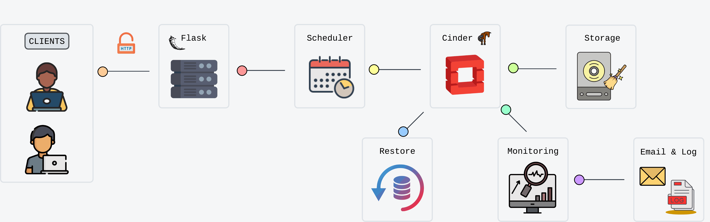
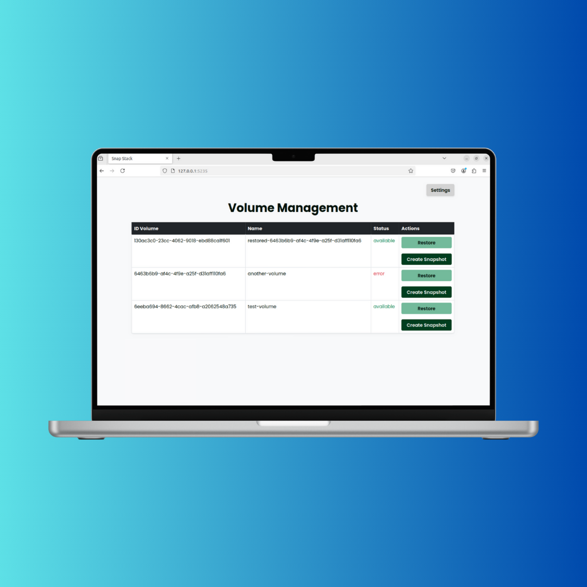

# Snap Stack - OpenStack Plugin


## Description

Snap Stack is an advanced plugin for OpenStack that automates snapshot management and volume recovery. It offers a scalable and configurable solution to improve volume resiliency and optimize storage utilization.

## Prerequisites

To use Snap Stack, it is necessary to have **DevStack** installed. The official instructions for installing it properly are as follows:

- [DevStack Installation Guide](https://docs.openstack.org/devstack/latest/)

## Main Features

- **Snapshot automation**: Scheduled creation of snapshots at defined intervals.
- **Continuous monitoring**: Monitoring the status of volumes with detection of anomalies.
- **Automatic recovery**: Quick recovery of volumes using the last valid snapshot.
- **Storage optimization**: Management of obsolete snapshots for efficient use of resources.
- **Real-time notifications**: Emails to alert administrators of any errors or important tasks.

## Used Technologies

- **Flask:** Lightweight micro web framework written in Python. It provides the foundation for creating Snap Stack's user-friendly interface.
- **APScheduler:** A Python library for scheduling tasks. Used to automate the creation of snapshots and other time-based operations.

## Workflow



## Installation Instructions

### 1. Configure `local.conf`

To enable Snap Stack you must add the following snippet to the `local.conf` file of your DevStack installation:

```bash
[[local|localrc]]
   ...
enable_plugin snap-stack https://github.com/your-username/snap-stack.git main
```

### 2. Start the installation script

Run the stack.sh script to configure the DevStack environment and include Snap Stack:
```bash
./stack.sh
```

Once completed, Snap Stack will be ready for use.

### 3. Accessing the interface

After installation, Snap Stack can be accessed by visiting:
```bash
http://<devstack_host>:5235
```
From here you can manage volumes, schedule snapshots, and configure the system.

## Preview


